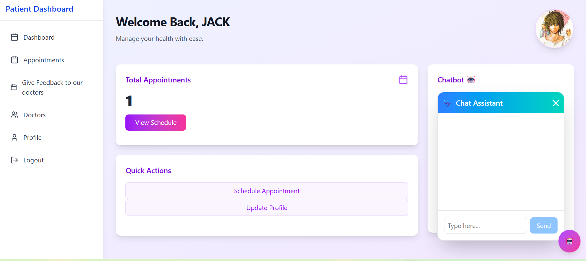

# 🏥 MERN Stack Healthcare Application

A full-stack Healthcare web application built using MongoDB, Express.js, React, and Node.js. Patients can book appointments, consult doctors, and access feedback — all in one place!

## 🚀 Features
- Patient & Doctor authentication.
- Doctor & Patient can update their profile.
- Patient can book Appointments by selecting doctor from available doctors list.
- Doctor can view all Appointments assinged to them and can change status to confirmed.
- After visiting the hospital, the patient can give feedback to doctor in this application.
- Doctor can view all feedbacks.
- AI assistant is there to help through application in both side, i.e, Doctor & patient.
- Protected Routes using JWT

## 🛠️ Tech Stack
- **Frontend**:React,TailwindCSS,DaisyUI.
- **Backend**:Node.Js,ExpressJs.
- **Database**:MongoDB.
- **Email Service Provider**:Formspree.
- **State Management**:Redux.

## ScreenShots:

### Home Page


### Login


### Doctor
* Dashboard

* Appointment

* Feedbacks

* Profile Update


### Patient
* Dashboard

* Booked Appointments

* Submit Feedbacks

* Profile Update

* Book Appointments


## 🔧 Installation Guide
### 📦 Frontend

```bash
cd client
npm install
npm run dev
```
### Backend

```bash
cd server
npm install
npm run dev
```

### Author
- Naushin Khan
[Github](https://github.com/Naushink27)
[Linkedin](https://www.linkedin.com/in/naushink27/)


